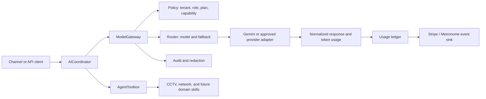

# AgentOS CCTV & Network Operations: Go-to-Market and Pricing Strategy

**Author:** Manus AI  
**Status:** Productization baseline for the `upgrade/commerce-domains` branch  
**Date:** 16 August 2026

## Executive summary

AgentOS should enter the market as a **domain-agnostic operations layer for mixed physical and digital infrastructure**, beginning with CCTV and network operations because these environments have measurable assets, recurring alarms, fragmented vendor consoles, and clear economic value from faster diagnosis. The product should not compete as another camera manufacturer, NVR, or generic chatbot. Its differentiated promise is that one authorized agent can observe, explain, and execute across ONVIF-compatible cameras, Hikvision and Dahua estates, routers, switches, access points, gateways, and mobile or desktop endpoints while preserving a single audit trail.

The commercial model should combine a predictable platform subscription with metered managed AI operations. This avoids exposing customers to raw token economics while protecting AgentOS from unbounded model costs. Business should be the self-serve and small multi-site offer. Pro Fleet should be the MSP, integrator, and larger multi-site offer with fleet controls, delegated administration, higher included usage, policy enforcement, integrations, and stronger support. Enterprise terms should remain custom until retention, compliance, uptime, and support obligations are validated in production.

## Product thesis and positioning

> **AgentOS turns heterogeneous camera and network infrastructure into one authorized, explainable operations surface.**

The system is strongest where a customer owns existing equipment and cannot justify replacing it merely to obtain a modern cloud console. The current CCTV facade already supports vendor-neutral operations with Hikvision and Dahua adapters, NVR multi-channel streaming, authorization checks, and credential redaction. The network-tools skill and Cordova bridge extend the same operating model to local/native telemetry on Linux, Windows, mobile, and browser-compatible deployments. The Unified AgentToolbox provides a stable discovery and execution boundary, which is the foundation for adding future domains without changing the customer-facing interaction model.

AgentOS should be described as **open-architecture operational intelligence**, not as an AI camera product. Market evidence supports this framing: an open cloud VMS benchmark advertises ONVIF compatibility, reuse of existing cameras, per-camera pricing, multi-site administration, hybrid deployment, and white-label options [1]. AgentOS can use those expectations as table stakes while differentiating on cross-domain network operations and authorized action execution.

## Priority customer profiles and use cases

The first commercial segment should be service providers and operators that manage multiple sites but do not have a large internal security or network engineering team. These buyers experience the highest value from fleet-wide visibility, reusable playbooks, and delegated access.

| Priority | Customer profile | Operational pain | AgentOS wedge | Buying trigger | Success metric |
| --- | --- | --- | --- | --- | --- |
| 1 | Security integrators and managed service providers | Many customer estates, inconsistent vendors, expensive first-line triage | Multi-tenant fleet console, white-label-ready agent workflows, role-based tools, audit logs | Need recurring managed-service revenue without replacing installed cameras | Sites per operator, incidents resolved remotely, gross margin per site |
| 2 | Retail, logistics, hospitality, and property groups | Distributed sites, camera blind spots, network outages, slow escalation | Unified CCTV and network health, incident summaries, cross-site search, escalation workflows | Expansion to new sites or a high-cost outage/security event | Mean time to detect, mean time to resolution, avoidable truck rolls |
| 3 | Education, healthcare, and public-sector estates | Compliance-sensitive access, mixed legacy infrastructure, limited staffing | Fail-closed authorization, redacted credentials, local processing options, immutable audit trail | Compliance review, procurement refresh, or consolidation of tools | Authorized actions, audit completeness, policy violations |
| 4 | Small operators and advanced installers | Need professional monitoring without enterprise complexity | Business plan with guided onboarding and predictable fleet limits | First multi-camera deployment or desire to add network monitoring | Time to first connected site, activation rate, monthly retention |

The first three repeatable use cases should remain narrow enough to sell and broad enough to demonstrate the domain-agnostic architecture. First, **incident triage** correlates camera availability, network reachability, and recent alerts into a concise operator explanation. Second, **authorized remediation** performs bounded actions such as restarting a service, testing connectivity, or opening a live stream only when the actor, site, role, and tool policy permit it. Third, **fleet reporting** turns recurring device and network telemetry into an operational report with exceptions, trends, and recommended maintenance actions.

| Use case | User request | AgentOS behavior | Guardrail |
| --- | --- | --- | --- |
| Camera outage triage | “Why are cameras 7–12 offline at Site B?” | Check NVR/channel health, network path, recent events, and return an evidence-linked diagnosis | Read-only by default; no credentials in responses |
| Multi-channel live view | “Open the loading-bay channels.” | Resolve authorized NVR channels and return a controlled stream/session descriptor | Explicit site/channel authorization; fail closed |
| Network incident response | “Test the gateway and uplink from the local app.” | Use native network telemetry and network-tools execution | Device scope, command allowlist, confirmation for mutation |
| Preventive maintenance | “Show sites with rising packet loss and camera retries.” | Aggregate telemetry, rank exceptions, and produce a maintenance queue | Tenant isolation and retention policy |
| Managed-service report | “Prepare this month’s fleet report.” | Summarize incidents, actions, SLA exposure, and unresolved exceptions | Redact secrets and identify model-generated recommendations |

## Product packaging

AgentOS should be packaged as three layers. The **Operations Core** includes the gateway, tenant and role model, audit records, skill registry, toolbox, health status, and cross-platform clients. The **CCTV Operations** package includes ONVIF-oriented discovery where available, Hikvision and Dahua adapters, NVR multi-channel streaming, channel authorization, event and availability views, and retention-aware incident workflows. The **Network Operations** package includes local/native telemetry, interface and connectivity inspection, network-tool execution, and platform adapters for desktop, mobile, and browser contexts.

AI should be positioned as an operational multiplier rather than the product’s only value. Customers retain value from the inventory, policy engine, audit trail, alerting, and integrations even when AI usage is paused. This is important for trust, margin protection, and portability across cloud and open models.

## Model gateway architecture

The implemented `ModelGateway` should be the only application boundary allowed to invoke metered cloud reasoning. Skills and channels request a capability, tenant, plan, messages, and an optional preferred model. The gateway selects a permitted provider, estimates cost before execution, checks the tenant’s daily and monthly budget, invokes the provider adapter, normalizes usage, emits a redacted usage event, and returns the model result with usage metadata.

The gateway should support four operating modes. In **standard reasoning**, it chooses a low-cost fast model for routine summaries and classification. In **advanced reasoning**, it chooses a stronger model only when the request requires multi-step diagnosis or planning. In **vision**, it routes image or frame analysis to a multimodal model. In **local-only**, it returns deterministic telemetry and tool results without cloud reasoning. A customer-facing plan should expose these as capabilities, not provider-specific model names.

The gateway must be fail-closed in three places. It must reject requests without a tenant identifier, reject estimated usage that would breach the plan budget, and reject provider tool calls that do not pass the existing skill authorization context. Credentials, API keys, authorization headers, and passwords must never be included in usage metadata. Provider-specific usage should be normalized to input tokens, output tokens, model, cost estimate, tenant, plan, timestamp, and a redacted operation context.

Stripe describes support for token-based, outcome-based, credit-burndown, subscription-with-overages, and multidimensional pricing, alongside customer usage dashboards, threshold alerts, anomaly detection, and revenue recovery [2]. AgentOS should initially implement a local durable usage ledger and an event-sink interface. Stripe Billing can handle subscriptions and invoices first; Metronome should be introduced when event volume, pricing experimentation, or multidimensional contracts justify the added billing infrastructure [3].

A practical event contract is:

| Field | Purpose |
| --- | --- |
| `id` | Idempotency key for billing ingestion |
| `occurredAt` | Usage-event timestamp |
| `tenantId` | Customer account boundary |
| `plan` | Contract and policy lookup |
| `model` | Internal cost attribution |
| `inputTokens`, `outputTokens` | Provider-normalized usage |
| `costUsd` | Internal cost estimate, not necessarily customer price |
| `metadata` | Redacted channel, site, capability, and operation context |

Google’s official Gemini pricing page separates free, paid, and enterprise access, lists model-specific input/output and caching prices, and charges grounding separately [4]. The exact rates are time-sensitive, so AgentOS should load provider pricing from versioned configuration and revalidate it before each commercial price revision. Customer contracts should not promise a fixed provider cost; they should promise included operations, transparent overage rules, and budget controls.

## Recommended plans

The proposed prices are launch hypotheses for validation, not irreversible commitments. They are intentionally above raw model cost because the customer is buying secure integration, device compatibility, fleet operations, support, and reduced labor rather than tokens.

| Feature | Business | Pro Fleet |
| --- | ---: | ---: |
| Monthly platform price, annual commitment | **$299/month** | **$999/month** |
| Included sites | 5 | 25 |
| Included cameras | 25 | 150 |
| Included managed network devices | 100 | 750 |
| Included managed AI operations | 10,000/month | 60,000/month |
| Additional standard AI operations | $0.012 each | $0.009 each |
| Advanced reasoning operation | $0.05 each | $0.035 each |
| Cloud retention baseline | 14 days of indexed metadata; video storage quoted separately | 30 days of indexed metadata; video storage quoted separately |
| Users and roles | 10 users, site-level roles | 50 users, hierarchical fleet RBAC |
| CCTV capabilities | Vendor-neutral inventory, Hikvision/Dahua adapters, NVR multi-channel authorization | All Business capabilities plus fleet templates, delegated admin, cross-site incident workflows |
| Network capabilities | Local/native telemetry, interface and connectivity checks, allowlisted tools | All Business capabilities plus fleet policy templates, site baselines, escalation queues, API/webhooks |
| Deployment | Hosted gateway or customer-managed gateway | Hosted, hybrid, or customer-managed gateway |
| Support | Business-hours support, standard onboarding | Priority support, onboarding workshop, quarterly operations review |
| Included integrations | Webhook/API export, standard channels | Webhook/API export, SSO-ready integration path, partner tooling |

The Business plan should be sold directly through a guided trial or installer referral. Its limit model should be easy to understand: sites, cameras, network devices, and included AI operations. Pro Fleet should be sold through an MSP and integrator motion, where the buyer can resell or bundle managed operations. White-labeling, custom retention, SSO/SAML, dedicated infrastructure, SLA-backed uptime, and compliance reviews should remain Enterprise add-ons rather than being prematurely included in Pro Fleet.

Overages should be capped by default. Customers should receive alerts at 70%, 85%, and 100% of included AI operations and may choose hard-stop, approval-required, or automatic-overage behavior. The default for new accounts should be approval-required at the budget threshold. A customer must never receive an unexpected invoice merely because a noisy camera or network incident generated repeated reasoning requests.

The unit-economics objective is to maintain at least 75% software gross margin before support and infrastructure at normal utilization. The gateway’s preflight estimate, model routing, caching, batch processing where appropriate, and local-only mode are the controls that protect that objective. The product team should measure cost per resolved incident, not only cost per token, because the commercial outcome is operational labor avoided.

## Go-to-market motion

The initial route to market should be **partner-led with proof-of-value deployment**. Security integrators already own camera relationships, network installers already own site relationships, and MSPs already own recurring-service contracts. AgentOS should give those partners a repeatable deployment kit: compatibility assessment, connector onboarding, policy templates, a site health baseline, and a 14-day report showing incidents detected, actions authorized, and truck rolls avoided.

The direct message to operators should be concrete: “Keep the cameras and network equipment you already own; add one authorized operations layer.” The message to integrators should be commercial: “Turn fragmented device support into a recurring fleet service without building a new control plane.” The message to MSPs should be operational: “Let one operator supervise more sites while keeping high-risk actions permissioned and auditable.”

| Funnel stage | Asset or action | Exit criterion |
| --- | --- | --- |
| Awareness | Compatibility matrix, incident-cost calculator, and short CCTV/network workflow demonstrations | Qualified site or fleet with known device counts |
| Evaluation | Guided connection of one site and read-only health baseline | Customer sees device inventory and at least one actionable exception |
| Proof of value | 14-day monitored pilot with authorized remediation disabled by default | Quantified incidents, operator time, and escalation improvements |
| Conversion | Business or Pro Fleet proposal with usage budget and deployment plan | Paid subscription and production policy approval |
| Expansion | Add sites, channels, network devices, integrations, and managed-service seats | Net revenue retention and partner attach rate increase |

The primary launch channels should be security integrator partnerships, regional MSPs, network installers, and targeted case studies with multi-site operators. Paid acquisition should wait until the team knows which use case produces the clearest economic proof. The first case studies should quantify mean time to detect, mean time to resolve, prevented truck rolls, and percentage of incidents resolved without a vendor portal switch.

## Trust, security, and cross-platform requirements

Every commercial deployment should preserve tenant isolation, role-based authorization, explicit confirmation for destructive actions, audit records, credential redaction, and platform capability reporting. Linux and Windows deployments should share the same gateway protocol and policy model. Mobile and Cordova should expose local telemetry only through the registered plugin bridge, with browser-safe fallbacks that return `supported: false` rather than pretending to have native access. The desktop and PWA surfaces should remain presentation clients of the same gateway and toolbox contracts.

The current Cordova network-tools bridge has been hardened to defer loading `cordova/exec` until invocation. The local plugin is also registered in `config.xml` and package metadata, which aligns clean installs with the mobile application’s intended capability set. Native availability should still be reported through `capabilities()` so the agent can distinguish browser, desktop, Android, and iOS execution paths.

## 90-day execution plan

During days 1–30, the team should finish the gateway integration tests, persist usage events, expose a tenant usage endpoint, and run two read-only pilots with one integrator and one multi-site operator. During days 31–60, it should add the Business trial flow, Pro Fleet fleet administration, budget alerts, and a Stripe subscription path while keeping video storage and enterprise compliance as separately quoted components. During days 61–90, it should publish the first case study, launch partner enablement, validate overage behavior, and decide whether event volume justifies Metronome adoption.

The launch gate should be evidence-based. AgentOS should not broaden the target market until it can demonstrate that customers connect existing cameras and network devices reliably, operators understand why the agent recommended an action, policy enforcement prevents unauthorized mutation, and the subscription plus overage model remains profitable under realistic incident volume.

## Key metrics

| Category | Metric | Initial target |
| --- | --- | ---: |
| Activation | Time from signup to first connected site | Under 60 minutes |
| Product value | Incidents with evidence-backed diagnosis | At least 80% |
| Operations | Read-only incidents resolved without portal switching | At least 50% in pilot |
| Safety | Unauthorized high-risk actions completed | 0 |
| Reliability | Usage events with idempotent ledger records | 100% |
| Economics | Software gross margin at normal utilization | At least 75% |
| Commercial | Business trial-to-paid conversion | Validate first; target 20%+ after onboarding refinement |
| Expansion | Pro Fleet sites added within 90 days | Validate by partner cohort |

## References

[1]: https://www.ifovea.com/cloud-vms-pricing/ "Ifovea Enterprise Cloud VMS Pricing"
[2]: https://stripe.com/billing/usage-based-billing "Stripe: Usage-based billing with Metronome"
[3]: https://docs.stripe.com/billing/usage-based "Stripe documentation: Usage-based billing"
[4]: https://ai.google.dev/gemini-api/docs/pricing "Google AI for Developers: Gemini API pricing"
