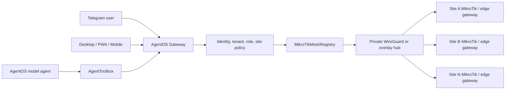

# Multi-MikroTik Mesh Remote Access for Telegram and AgentOS

## Recommended offer

Offer this as **AgentOS Secure Network Mesh**: a managed control plane that connects many customer MikroTik sites through private, outbound-initiated tunnels and exposes only authorized operations to Telegram, the desktop application, mobile clients, and AgentOS agents.

The key commercial promise is not “remote Winbox over Telegram.” It is:

> **One bot and one agent can supervise multiple MikroTik sites without exposing RouterOS management ports to the public internet.**

Telegram should never connect directly to a router. Telegram sends a request to the AgentOS gateway. The gateway identifies the Telegram user, resolves the selected site, checks tenant and role policy, calls the mesh registry, and returns a redacted result. The model agent follows the same path through the AgentToolbox, so both human and automated operations share the same authorization and audit boundary.

## Topology



Use one of two deployment modes. For a small controlled fleet, configure **RouterOS WireGuard site-to-hub peers** and run the AgentOS gateway on a private cloud or customer server. For larger or frequently changing fleets, place a Linux edge connector at each site and use WireGuard, Tailscale, or a self-hosted Headscale control plane. The edge connector can reach the local MikroTik API over the LAN while the AgentOS gateway reaches the connector over the private overlay. This avoids requiring every router to be individually reachable from the cloud.

MikroTik RouterOS supports WireGuard peers with public-key identity, per-peer allowed addresses, persistent keepalive for peers behind NAT, and explicit site-to-site routes [1]. Tailscale’s subnet-router pattern provides a useful managed-mesh equivalent for legacy devices and whole subnets, with centralized access-control rules and route approval [2]. MikroTik Back To Home is useful for an individual owner or temporary guest tunnel, but its own documentation positions it as a convenience feature and recommends manually configured advanced VPN controls for granular security [3].

## Network boundaries

Each site should have a unique mesh identity and a non-overlapping management address. The AgentOS gateway should use RouterOS API-SSL on the private overlay, normally port 8729, or communicate with a local connector that owns the LAN connection. RouterOS API, Winbox, SSH, and HTTP management ports must not be forwarded from the public internet.

| Layer | Rule |
| --- | --- |
| Internet edge | Allow only the overlay transport; deny public RouterOS management ports |
| Overlay | One peer identity per site or edge connector; rotate and revoke independently |
| Site routing | Advertise only the management subnet or connector address required for operations |
| AgentOS gateway | Resolve `tenantId` and `siteId` before any connection or tool call |
| Tool layer | Read-only tools by default; mutations require explicit confirmation and policy approval |
| Telegram | Treat chat IDs as identities, not as authorization by themselves; map them to AgentOS users and roles |
| Audit | Record user, channel, tenant, site, tool, result status, timestamp, and approval reference without secrets |

Avoid one flat mesh where every site can reach every other site. The hub should provide controlled management access, not unrestricted site-to-site transit. If site-to-site communication is required, create an explicit policy and route pair for those sites.

## Telegram user experience

Use inline keyboards for site selection and confirmation. Do not ask a user to type router IP addresses or credentials into Telegram. The first successful authorization should show only the sites that the Telegram identity can access.

```text
/start
  ├── Network Mesh
  │     ├── Site status
  │     ├── Select site
  │     ├── Run diagnostics
  │     └── Fleet summary
  ├── CCTV
  ├── Users and vouchers
  └── Help and approvals
```

The recommended command surface is:

| Telegram action | Example | Behavior |
| --- | --- | --- |
| Site list | `/sites` | Shows authorized sites with online/offline state |
| Site selection | Inline button `site:store-01` | Stores a short-lived session selection; never trusts free-form site names |
| Health | `/health` | Returns identity, uptime, CPU, interfaces, and connectivity summary |
| Diagnostics | `/diagnose` | Runs a bounded read-only diagnostic bundle against the selected site |
| Fleet summary | `/fleet_health` | Runs read-only health checks across explicitly authorized sites |
| Change request | `/block 192.0.2.10` | Creates a pending approval request rather than immediately mutating the router |
| Approval | Inline button `approve:<opaque-request-id>` | Requires the user’s role, recent authentication, and policy match |
| Emergency stop | `/revoke_site` | Disables the site peer or connector through an administrator-only path |

Callback data should contain opaque request IDs or short site IDs, not credentials, raw commands, or long untrusted arguments. Every callback must be re-authorized when clicked because Telegram messages and callback buttons can outlive the user’s role assignment.

High-risk actions such as rebooting a router, changing firewall rules, modifying NAT, executing raw API calls, or changing credentials should use a two-step flow. The first step creates a review card containing the target site, exact intended action, affected object, expiration time, and risk level. The second step confirms the action and records the approving Telegram user. For fleet actions, require `allowFleet` plus a policy that explicitly permits the operation across the selected site set.

## AgentOS tool contract

Expose domain tools through the toolbox rather than exposing a raw MikroTik client to the model. A minimal tool family is:

```text
mikrotik.mesh.list_sites
mikrotik.mesh.site_health
mikrotik.mesh.diagnose
mikrotik.mesh.execute_readonly
mikrotik.mesh.create_change_request
mikrotik.mesh.approve_change_request
mikrotik.mesh.fleet_health
```

The model should be allowed to select a site and request a diagnostic, but it should not be allowed to invent a site identifier, bypass the policy engine, or directly call `api.raw`, `cli.execute`, `system.reboot`, or firewall mutation tools. The AgentOS runtime should validate tool schemas, apply the safety envelope, and route the final call through `MikroTikMeshRegistry`.

A safe agent context contains `tenantId`, `userId`, `channel`, `authorizedSiteIds`, `role`, `requestId`, and `confirmed`. It should not contain RouterOS passwords or private keys. The registry should reject a missing tenant, unknown site, cross-tenant site, unapproved fleet execution, or mutation without confirmation.

## Onboarding flow

The customer onboarding flow should create the control-plane record first, then establish the network path, then validate read-only operations. An installer can provide a site name, local subnet, RouterOS version, and a one-time enrollment code. AgentOS generates the site identity and allowed route. The installer applies a narrowly scoped RouterOS configuration or installs the edge connector. The gateway then runs identity, health, and route checks before the site becomes visible to Telegram users.

Do not collect permanent RouterOS credentials through Telegram. Prefer a dedicated least-privilege RouterOS service account stored in the gateway’s secret manager or, where possible, a local connector that stores the credential at the site. The onboarding result should show the peer status, last handshake, API reachability, and the exact tools enabled for the site.

## Sellable packages

| Package | Recommended customer | Included service |
| --- | --- | --- |
| Mesh Connect | Installer or small operator | Up to 5 sites, private overlay enrollment, read-only health, Telegram site selection |
| Managed Network Operations | Retail, hospitality, property, education, or MSP | Up to 25 sites, diagnostics, alerting, approved remediation, fleet reporting, AgentOS workflows |
| Pro Fleet Operations | MSP, integrator, or regional operator | 25+ sites, delegated administration, fleet health, policy templates, API/webhooks, priority support |
| Enterprise Control Plane | Regulated or large multi-site customer | Customer-managed gateway, private control plane, SSO, retention controls, SLA, custom routing and compliance review |

Price the service primarily by managed sites and devices, then meter AI operations separately with budget controls. Customers should see included operations, current usage, and a hard-stop or approval setting. Raw token counts remain an internal cost and margin metric.

## Implementation mapping in AgentOS

The `MikroTikMeshRegistry` provides the first control-plane abstraction. It registers a stable `siteId`, keeps the private overlay host and credentials inside the gateway, reuses the existing MikroTik manager, enforces tenant and site authorization, requires confirmation for mutations, supports explicit fleet execution, and emits redacted audit events. The next integration should register registry-backed tools in the AgentToolbox and pass Telegram or agent context into every execution.

The current Telegram class already has inline-keyboard callbacks, rate limiting, session state, and confirmation behavior. Add mesh-specific handlers to that existing flow rather than creating a second Telegram bot. The implementation should start with `/sites`, site-selection callbacks, read-only `/health`, and `/fleet_health`; add change requests only after audit events and approval persistence are in place.

## References

[1]: https://help.mikrotik.com/docs/spaces/ROS/pages/69664792/WireGuard "MikroTik RouterOS WireGuard documentation"
[2]: https://tailscale.com/docs/features/subnet-routers "Tailscale subnet routers documentation"
[3]: https://help.mikrotik.com/docs/spaces/ROS/pages/197984280/Back+To+Home "MikroTik RouterOS Back To Home documentation"
