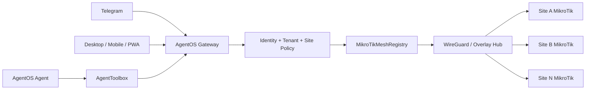

# AgentOS Secure MikroTik Mesh Remote Access

## Slide 1 — Title
**AgentOS Secure MikroTik Mesh Remote Access**

One private mesh. Many RouterOS 7 sites. One authorized Telegram and agent operations surface.

`upgrade/commerce-domains` · Product and implementation briefing

## Slide 2 — The customer problem
Multi-site operators manage heterogeneous MikroTik networks through separate Winbox sessions, changing public addresses, VPN exceptions, and manual escalation.

The result is slow incident response, excessive truck rolls, weak auditability, and unsafe pressure to expose management ports.

**Positioning:** AgentOS is an authorized operations layer, not a replacement router or another chat bot.

## Slide 3 — Recommended topology


Use outbound-initiated private connectivity. Do not expose RouterOS API, Winbox, SSH, or HTTP management ports to the public internet.

## Slide 4 — RouterOS 7 reality check
**Already available:** existing MikroTik manager, RouterOS tool registry, connection lifecycle, health methods, WireGuard-compatible private addressing, and the new multi-site registry boundary.

**Not fully ported yet:** complete RouterOS 7 menu coverage, typed schemas for every RouterOS command, version-aware feature negotiation, API-SSL certificate lifecycle, WireGuard peer provisioning, route/firewall reconciliation, and full Telegram-to-mesh dependency injection in every gateway startup path.

**Principle:** expose supported capabilities explicitly instead of pretending all RouterOS 7 features are portable.

## Slide 5 — Code structure
`src/core/mikrotik-mesh.js` contains five layers:

1. **Policy constants:** default read-only tool allowlist and sensitive-field redaction pattern.
2. **Registry state:** `sites` map keyed by stable `siteId`.
3. **Lifecycle:** `register`, `connect`, `remove`, `destroy`, and status description.
4. **Execution:** `execute`, `executeFleet`, and `health` reuse the existing MikroTik manager.
5. **Audit boundary:** redacted audit events emitted through the event bus and optional sink.

The registry stores private connection configuration internally and returns redacted site descriptions externally.

## Slide 6 — Telegram inline-keyboard flow
```text
/start → Network button or /sites
       → authorized site list
       → short-lived opaque callback token
       → site action menu
       → Health / Fleet health
       → re-check tenant and site authorization
       → mesh registry
```

Buttons use `mesh:site:<token>` and `mesh:health:<token>` rather than raw credentials or long commands. Tokens expire after five minutes. Every callback is authorized again when clicked.

## Slide 7 — Agent tool contract
Expose controlled tools through AgentToolbox:

- `mikrotik.mesh.list_sites`
- `mikrotik.mesh.site_health`
- `mikrotik.mesh.execute_readonly`
- `mikrotik.mesh.fleet_health`
- `mikrotik.mesh.create_change_request`
- `mikrotik.mesh.approve_change_request`

Agents receive `tenantId`, `authorizedSiteIds`, `role`, `requestId`, and approval state. They do not receive RouterOS passwords, private keys, raw CLI access, or unrestricted site-to-site routing.

## Slide 8 — Safety and authorization
Read-only tools run by default. Mutations require explicit confirmation, a valid tenant/site scope, an approval identifier, and a policy decision.

High-risk examples include reboot, firewall mutation, NAT changes, raw API calls, credential changes, and fleet-wide operations.

Every action produces a redacted audit event containing actor, channel, site, tool, approval, result, and timestamp.

## Slide 9 — Sellable packages
| Package | Scope | Buyer |
|---|---|---|
| Mesh Connect | Up to 5 sites; private enrollment; read-only Telegram health | Installer / small operator |
| Managed Network Operations | Up to 25 sites; diagnostics; approved remediation; reporting | Multi-site operator / MSP |
| Pro Fleet Operations | 25+ sites; delegated administration; policy templates; API/webhooks | MSP / integrator |
| Enterprise Control Plane | Customer-managed gateway; SSO; SLA; compliance controls | Regulated / large fleet |

Price by managed sites and devices, then meter AI operations with budget alerts and hard-stop or approval-required controls.

## Slide 10 — Rollout plan and decision gate
**0–30 days:** finish RouterOS 7 capability matrix, API-SSL/overlay enrollment, durable site records, and one read-only pilot.

**31–60 days:** add approval persistence, Telegram health workflows, alerting, and Business plan onboarding.

**61–90 days:** launch MSP partner package, Pro Fleet controls, case study, and usage economics review.

**Launch gate:** no unsafe public management exposure, complete tenant isolation, reliable site health, explainable agent actions, and measurable reduction in operator time or truck rolls.

## Slide 11 — Closing
**AgentOS Secure Network Mesh**

Keep the routers and cameras customers already own. Add a private, policy-controlled operations layer that humans and agents can use safely.

Next engineering priority: complete RouterOS 7 capability negotiation and inject the mesh registry into every Telegram and gateway startup path.
